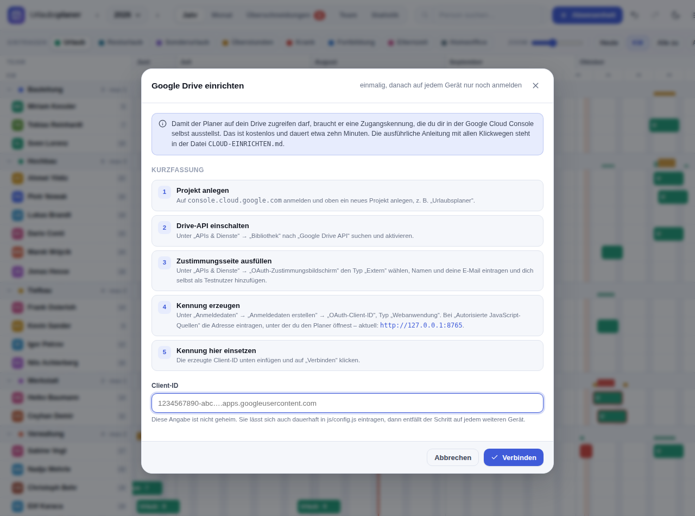
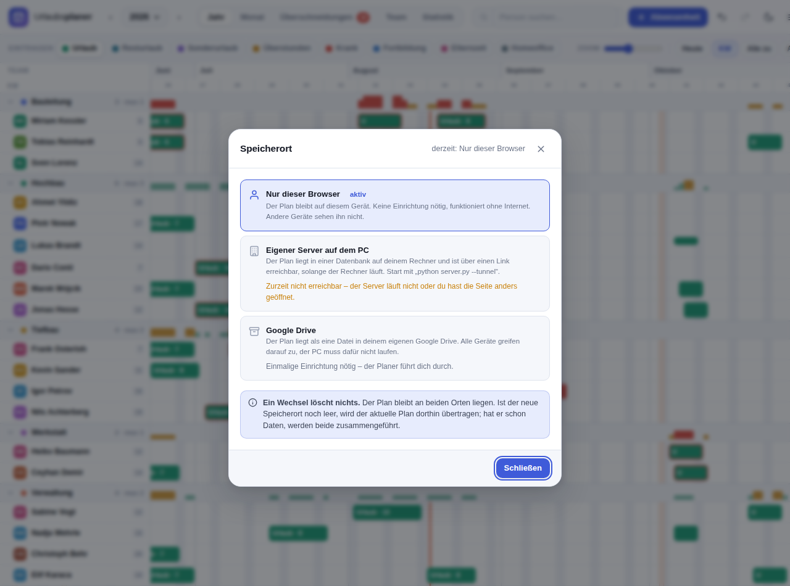

# Google Drive als Speicher einrichten

Der Plan liegt dann als **eine Datei in deinem eigenen Google Drive**. Alle
Geräte – PC, Handy, Laptop – greifen darauf zu und sehen denselben Stand. Ein
Rechner, der durchgehend laufen muss, ist nicht nötig.

Die Einrichtung ist einmalig und dauert etwa zehn Minuten. Danach meldet sich
jedes weitere Gerät nur noch mit dem Google-Konto an.

> **Vorab zum Datenschutz:** Der Planer kann Krankheitstage erfassen. Das sind
> Gesundheitsdaten nach Art. 9 DSGVO. Sie liegen dann unverschlüsselt in einem
> Google-Konto. Kläre das im Zweifel mit der Person, die bei euch für
> Datenschutz zuständig ist – oder verzichte auf die Art „Krank“ und trage
> Ausfälle stattdessen als „Sonderurlaub“ ein.

---

## Teil 1 – Zugangskennung bei Google erstellen

Google verlangt, dass sich jede Anwendung ausweist, die auf ein Drive zugreift.
Diesen Ausweis stellst du dir selbst aus. Er ist kostenlos und **nicht geheim** –
er darf offen im Quelltext stehen.

> Google hat die Konsole 2025 umgebaut: Was früher unter „APIs und Dienste →
> OAuth-Zustimmungsbildschirm“ lag, heißt jetzt **Google Auth-Plattform**. Viele
> Anleitungen im Netz beschreiben noch die alte Oberfläche. Die Schritte unten
> gelten für die neue. Da die Konsole zweisprachig genutzt wird, stehen die
> englischen Bezeichnungen in Klammern.

### 1. Projekt anlegen

1. [console.cloud.google.com](https://console.cloud.google.com) öffnen und mit
   dem Google-Konto anmelden, in dessen Drive der Plan liegen soll.
2. Oben in der Kopfzeile auf die Projektauswahl klicken → **Neues Projekt**
   (*New Project*).
3. Name: `Urlaubsplaner`. **Erstellen**.
4. Warten, bis das Projekt angelegt ist, und oben darauf umschalten. Alles
   Folgende passiert in diesem Projekt – bei Fehlern lohnt der Blick nach oben,
   ob noch das richtige ausgewählt ist.

### 2. Drive-API einschalten

1. Im Menü links: **APIs und Dienste** → **Bibliothek** (*Library*).
2. Nach `Google Drive API` suchen und darauf klicken.
3. **Aktivieren** (*Enable*).

### 3. Zustimmungsbildschirm einrichten

Das ist die Seite, die Google später anzeigt, wenn du dem Planer den Zugriff
erlaubst.

1. Im Menü links **Google Auth-Plattform** (*Google Auth Platform*) öffnen.
   Falls du sie nicht findest: oben in der Suche `Google Auth` eingeben.
2. Beim ersten Mal erscheint **Jetzt starten** (*Get started*) – ein Assistent
   mit vier Abschnitten auf einer Seite:
   - **App-Informationen**: App-Name `Urlaubsplaner`, Nutzersupport-E-Mail deine
     Adresse
   - **Zielgruppe** (*Audience*): **Extern** (*External*)
   - **Kontaktdaten**: deine E-Mail-Adresse
   - Nutzungsbedingungen bestätigen → **Erstellen**
3. Danach links auf **Zielgruppe** (*Audience*). Unten bei **Testnutzer**
   (*Test users*) auf **Nutzer hinzufügen** und deine eigene Google-Adresse
   eintragen – ebenso die Adressen aller Kolleginnen und Kollegen, die den
   Planer nutzen sollen. **Speichern**.

   Ohne diesen Schritt lehnt Google die Anmeldung mit „Zugriff verweigert“ ab.

### 4. Kennung erzeugen

1. In der **Google Auth-Plattform** links auf **Clients**, dann
   **Client erstellen** (*Create client*).
   *Der alte Weg über* **APIs und Dienste → Anmeldedaten → Anmeldedaten
   erstellen → OAuth-Client-ID** *führt zum selben Ziel und existiert weiterhin.*
2. Anwendungstyp (*Application type*): **Webanwendung** (*Web application*).
3. Name: `Urlaubsplaner Browser`. Der Name ist nur für dich.
4. Bei **Autorisierte JavaScript-Quellen** (*Authorized JavaScript origins*) auf
   **URI hinzufügen** und die Adresse eintragen, unter der du den Planer
   öffnest. **Ohne Schrägstrich am Ende, ohne Pfad.** Beispiele:

   | Wie du den Planer öffnest | Was hier eingetragen wird |
   |---|---|
   | lokal mit `python start.py` | `http://localhost:8000` |
   | lokal mit `python server.py` | `http://localhost:8000` |
   | im Heimnetz über die IP | `http://192.168.1.42:8000` |
   | über einen Cloudflare-Tunnel | `https://deine-adresse.trycloudflare.com` |
   | über Cloudflare Pages / GitHub Pages | `https://dein-name.pages.dev` |

   Mehrere Einträge sind erlaubt – trage ruhig alle ein, die du benutzt.
   **Autorisierte Weiterleitungs-URIs** (*Authorized redirect URIs*) bleiben
   leer; der Planer braucht sie nicht.
5. **Erstellen**. Es erscheint ein Fenster mit der **Client-ID**. Sie sieht so
   aus:

   ```
   123456789012-a1b2c3d4e5f6g7h8.apps.googleusercontent.com
   ```

   Diese Zeichenfolge kopieren. Ein danebenstehendes **Client-Secret** brauchst
   du nicht – der Planer läuft im Browser und verwendet keines.

### 5. Veröffentlichen (empfohlen)

Solange das Projekt auf **Testing** steht, läuft der Zugang nach sieben Tagen ab
und jedes Gerät muss sich neu anmelden. Das lässt sich abstellen:

1. **Google Auth-Plattform** → **Zielgruppe** (*Audience*).
2. Bei **Veröffentlichungsstatus** auf **App veröffentlichen**
   (*Publish app*) → bestätigen.

Eine Prüfung durch Google ist dafür **nicht** nötig. Der Planer nutzt
ausschließlich den Bereich `drive.file`, und der gilt bei Google als nicht
sensibel: Die Anwendung sieht nur Dateien, die sie selbst angelegt hat – der
übrige Inhalt deines Drive bleibt für sie unsichtbar. Deshalb entfällt das
Überprüfungsverfahren, das für weitergehende Zugriffe verlangt wird.

---

## Teil 2 – Kennung im Planer hinterlegen

Zwei Wege, beide führen zum selben Ergebnis.

**Fest in der Datei** (empfohlen, gilt dann für alle Geräte):

`js/config.js` öffnen und die Kennung eintragen:

```js
window.UP_CONFIG = {
  googleClientId: '123456789012-a1b2c3d4e5f6g7h8.apps.googleusercontent.com',
  driveFileName: 'Urlaubsplaner.json',
};
```

**Oder im Planer selbst:** Menü (☰) → **Speicherort wählen** → **Google Drive**.
Der Dialog fragt nach der Kennung und speichert sie in diesem Browser. Auf jedem
weiteren Gerät muss sie dann erneut eingegeben werden.



*Der Dialog zeigt in Schritt 4 die Adresse an, die bei Google unter
„Autorisierte JavaScript-Quellen“ eingetragen werden muss – genau so, wie der
Planer gerade geöffnet ist.*

Danach auf **Verbinden** klicken. Google fragt nach der Zustimmung, anschließend
lädt der Planer neu und arbeitet mit Drive.

Beim ersten Mal legt der Planer die Datei `Urlaubsplaner.json` in deinem Drive
an und überträgt den bisherigen Plan hinein. Du findest sie ganz normal in
[drive.google.com](https://drive.google.com) und kannst sie ansehen, kopieren
oder herunterladen.

---

## Teil 3 – Webversion erreichbar machen

Damit du den Planer auch unterwegs öffnen kannst, muss die Seite selbst
irgendwo liegen. Die Plandaten sind davon nicht betroffen – die kommen aus
deinem Drive.

### Cloudflare Pages (kostenlos, auch für private Repos)

1. [dash.cloudflare.com](https://dash.cloudflare.com) → **Workers & Pages** →
   **Create** → **Pages** → **Connect to Git**.
2. Dieses Repository auswählen.
3. Einstellungen:
   - Build command: *leer lassen*
   - Build output directory: `urlaubsplaner`
4. **Save and Deploy**.
5. Die entstandene Adresse (`https://…​.pages.dev`) in der Google Cloud Console
   unter **Autorisierte JavaScript-Quellen** ergänzen.

### GitHub Pages (kostenlos, nur für öffentliche Repos)

Der kürzeste Weg, wenn das Repository ohnehin auf GitHub liegt und öffentlich
ist. Pages liefert den kompletten Branch aus, Unterordner eingeschlossen.

1. Im Repository auf **Settings** → links **Pages**.
2. Unter **Build and deployment** → **Source**: `Deploy from a branch`.
3. **Branch**: `main`, Ordner `/ (root)` → **Save**.
4. Nach ein bis zwei Minuten ist der Planer erreichbar unter:

   ```
   https://<benutzername>.github.io/<repository>/urlaubsplaner/
   ```

   Die Datei `index.html` im Wurzelverzeichnis leitet dorthin weiter, sodass
   auch die kurze Adresse ohne `/urlaubsplaner/` funktioniert.
5. In der Google Cloud Console unter **Autorisierte JavaScript-Quellen**
   eintragen – **nur Schema und Host, ohne Pfad**:

   ```
   https://<benutzername>.github.io
   ```

> **Achtung, häufige Verwechslung.** Die Adresse gehört unter *Autorisierte
> JavaScript-Quellen*, **nicht** unter *Autorisierte Weiterleitungs-URIs*. Der
> Planer meldet sich über den Token-Client an, der keine Weiterleitung benutzt.
> Ein Eintrag bei den Weiterleitungs-URIs bleibt wirkungslos.

Bei einem öffentlichen Repository liegt die Client-ID in `js/config.js` offen –
das ist vorgesehen. Wer sie hat, kommt damit an keine Daten: Google lässt die
Anmeldung nur von den eingetragenen Adressen zu, fragt das Google-Konto des
Nutzers und gibt über `drive.file` nur die Datei frei, die die Anwendung selbst
angelegt hat. Solange der Zustimmungsbildschirm im Testbetrieb läuft, kommen
ohnehin nur die eingetragenen Testnutzer hinein.

### Ohne Hosting

Es geht auch ohne: `python start.py` auf dem PC und der Cloudflare-Tunnel aus
[ZUGRIFF-VON-UEBERALL.md](ZUGRIFF-VON-UEBERALL.md). Dann kommen die Seite vom
PC und die Daten aus dem Drive. Der PC muss dafür allerdings wieder laufen –
womit der Hauptvorteil der Drive-Lösung entfällt.

---

## Betrieb

### Was passiert bei gleichzeitigen Änderungen?

Dasselbe wie beim eigenen Server: Der Planer führt zusammen. Trägst du am PC
Urlaub für Anna ein und gleichzeitig am Handy für Bernd, sind hinterher beide
Einträge da. Nur wenn beide Geräte **denselben** Eintrag ändern, gewinnt das
Gerät, an dem du gerade arbeitest.

Drive kennt kein „nur schreiben, wenn unverändert“. Der Planer prüft deshalb
unmittelbar vor jedem Speichern die Versionsnummer der Datei. Es bleibt ein
Zeitfenster von Sekundenbruchteilen, in dem zwei Geräte gleichzeitig schreiben
könnten; die nächste Abfrage erkennt das und führt zusammen.

### Wie schnell sehen andere Geräte eine Änderung?

Der Planer fragt Drive alle acht Sekunden, ob sich etwas getan hat – bei
ausgeblendetem Tab seltener. Beim eigenen Server geht es schneller, weil der
von sich aus Bescheid geben kann.

### Wann wird gespeichert?

Automatisch, ohne Zutun: kurz nach jeder Eingabe, beim Wegschalten des Tabs,
beim Schließen des Tabs oder Browsers, sobald eine unterbrochene Verbindung
zurückkehrt, und beim nächsten Öffnen für alles, was offen geblieben ist.

Ist beim Schließen tatsächlich noch etwas unterwegs, fragt der Browser nach.
Verloren geht dabei nichts – der Stand liegt im Browser und wird beim nächsten
Start hochgeladen.

### Ohne Internet

Änderungen bleiben im Browser und gehen automatisch raus, sobald wieder eine
Verbindung besteht. Die Statusanzeige oben rechts steht so lange auf „Offline“.

### Frühere Fassungen

Klick auf die Statusanzeige oben rechts zeigt die Revisionen, die Google Drive
zu der Datei führt, und stellt sie auf Wunsch wieder her. Drive bewahrt diese
Revisionen allerdings nur begrenzt auf. Für ein dauerhaftes Archiv zusätzlich
über Menü → **Sicherung speichern** eine JSON-Datei ablegen.

### Speicherort wieder wechseln

Menü → **Speicherort**. Ein Wechsel löscht nichts: Die Drive-Datei bleibt
liegen, und der Planer führt zusammen, statt zu überschreiben.



---

## Wenn etwas nicht klappt

| Meldung | Ursache und Abhilfe |
|---|---|
| **„Zugriff blockiert: Autorisierungsfehler“ / „Fehler 400: origin_mismatch“** | Der häufigste Fall. Die Adresse fehlt unter **Autorisierte JavaScript-Quellen**, oder sie steht nicht exakt so da. Siehe eigener Abschnitt unten. |
| „Die Freigabe wurde abgelehnt“ | Dein Konto steht nicht als Testnutzer auf dem Zustimmungsbildschirm, oder du hast im Google-Fenster auf „Abbrechen“ geklickt. |
| „Die Client-ID ist unbekannt“ | Tippfehler beim Kopieren, oder die Kennung stammt aus einem anderen Projekt. |
| „Das Anmeldefenster wurde blockiert“ | Der Browser hat das Pop-up unterdrückt. Pop-ups für diese Seite erlauben. |
| Status bleibt auf „Anmelden“ | Die Google-Sitzung ist abgelaufen. Auf die Statusanzeige klicken. Passiert das alle paar Tage, ist das Projekt noch im Testmodus – siehe Schritt 5. |
| Datei taucht im Drive nicht auf | Suche nach `Urlaubsplaner.json`. Der Planer legt sie erst an, sobald er das erste Mal etwas speichert. |

### „origin_mismatch“ im Einzelnen

Google vergleicht die Adresse, von der die Anfrage kommt, buchstabengenau mit
den eingetragenen Quellen. Schon eine Kleinigkeit reicht zum Fehlschlag. Der
Reihe nach prüfen:

1. **Welche Adresse steht in der Adresszeile des Browsers?** `localhost:8000`
   und `127.0.0.1:8000` sind für Google **zwei verschiedene** Quellen. Trage
   im Zweifel beide ein:

   ```
   http://localhost:8000
   http://127.0.0.1:8000
   ```

2. **Stimmt der Port?** Ist 8000 belegt, weicht `start.py` auf 8001, 8002 …
   aus. Der tatsächliche Port steht im Konsolenfenster und in der Adresszeile.
   Der Einrichtungsdialog im Planer zeigt in Schritt 4 immer die Adresse an,
   die gerade gilt – die ist maßgeblich.

3. **Kein Schrägstrich am Ende**, kein Pfad. Richtig ist
   `http://localhost:8000`, falsch sind `http://localhost:8000/` und
   `http://localhost:8000/index.html`.

4. **Steht die Adresse im richtigen Feld?** Der Client hat zwei Listen. Der
   Planer benutzt ausschließlich **Autorisierte JavaScript-Quellen**. Ein
   Eintrag unter *Autorisierte Weiterleitungs-URIs* ändert nichts – der
   Token-Client leitet nicht weiter, er öffnet ein Fenster. Wer die Adresse
   dort einträgt, sucht den Fehler oft lange an der falschen Stelle.

5. **Ist es überhaupt die Adresse, unter der der Planer läuft?** Bei einer
   eingebetteten Vorschau – etwa einer veröffentlichten Seite in einer
   Chat-Oberfläche – läuft die Seite in einem abgeschotteten Rahmen unter
   einer fremden Adresse, die keine Anfragen an Google stellen darf. Dort
   lässt sich Drive grundsätzlich nicht einrichten; der Planer sagt das im
   Speicherort-Dialog auch. Nötig ist eine eigene Adresse, siehe Teil 3.

4. **Wurde gespeichert?** Nach dem Eintragen unten auf **Speichern**. Ohne das
   ist nichts übernommen.

5. **Der richtige Client?** Die Quelle gehört zu dem Client, dessen Client-ID
   im Planer steht – nicht zu einem zweiten, versehentlich angelegten.

6. **Kurz warten.** Google übernimmt Änderungen meist in Sekunden, laut
   eigener Dokumentation können es aber einige Minuten werden. Danach im
   Planer erneut auf „Verbinden“.

Was Google tatsächlich empfangen hat, verrät der Link **Fehlerdetails** auf der
Fehlerseite: Dort steht die Quelle, die abgelehnt wurde. Diese Zeichenfolge
gehört – genau so – in die Cloud Console.

## Grenzen

- **Ein Google-Konto ist der Eigentümer.** Andere Personen brauchen ein eigenes
  Google-Konto und müssen als Testnutzer eingetragen sein; sie greifen dann über
  ihr eigenes Konto auf dieselbe Datei zu, sobald du sie im Drive für sie
  freigibst.
- **Die Daten liegen unverschlüsselt.** Google könnte den Inhalt technisch
  einsehen. Wer das nicht möchte, bleibt beim eigenen Server.
- **Kein Rechtemodell.** Wer Zugriff auf die Datei hat, sieht und ändert den
  ganzen Plan. Wer nur zuschauen soll, bekommt einen CSV- oder PDF-Auszug.
