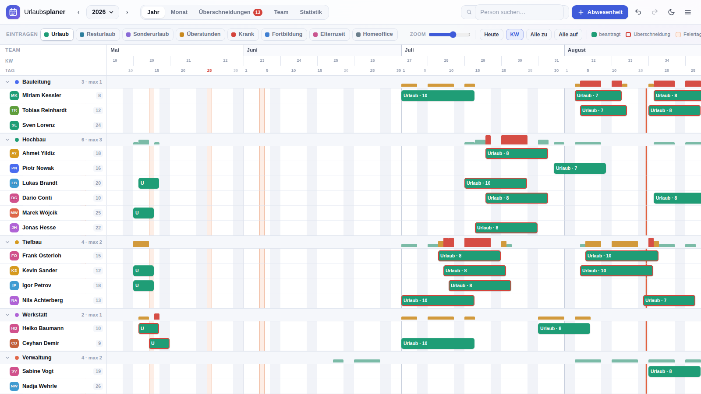
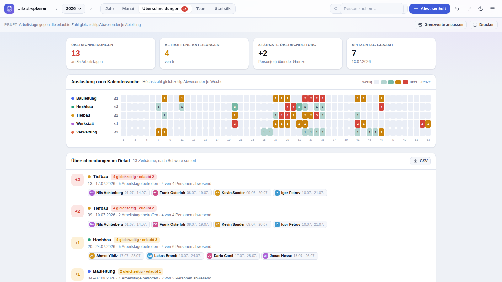
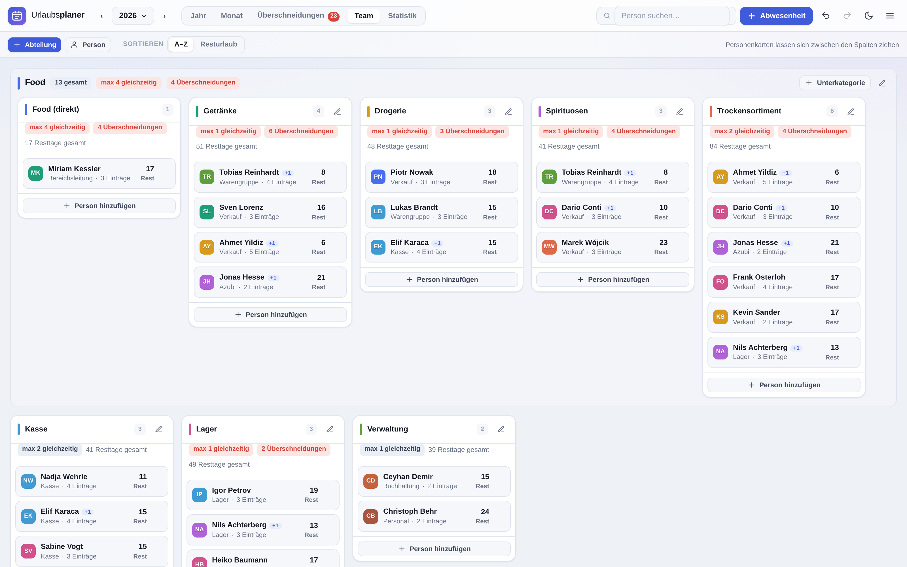

# Urlaubsplaner

Urlaubsplanung für Teams mit mehreren Abteilungen – läuft im Browser, ohne
Installation, ohne Server, ohne Konto. Der Schwerpunkt liegt auf der Frage:
**Wer ist wann gleichzeitig weg – und ist das noch tragbar?**



*Jahresansicht: alle Personen nach Abteilungen gruppiert. Die Balken über jeder
Abteilung zeigen tagesgenau die Belegung – rot, sobald zu viele gleichzeitig
fehlen. Betroffene Einträge bekommen einen roten Rahmen.*

## Starten

```bash
python start.py
```

Der Browser öffnet sich von selbst. Python ist auf Windows, macOS und Linux
meist schon vorhanden. `index.html` doppelklicken geht auch – allerdings
behandelt Chrome direkt geöffnete Dateien je nach Version als eigene Herkunft,
dann kann der Plan beim nächsten Start fehlen. Über `http://localhost` bleibt
er zuverlässig erhalten.

## Wo der Plan gespeichert wird

Drei Möglichkeiten, jederzeit umschaltbar über Menü → **Speicherort**:

| | Einrichtung | Von mehreren Geräten | PC muss laufen |
|---|---|---|---|
| **Nur dieser Browser** | keine | nein | – |
| **Eigener Server auf dem PC** | `python server.py --tunnel` | ja | ja |
| **Google Drive** | einmalig ~10 Minuten | ja | nein |

**Eigener Server:** Der Plan liegt in einer SQLite-Datenbank auf deinem
Rechner, ist passwortgeschützt und über eine HTTPS-Adresse von überall
erreichbar. Nichts verlässt das Haus.
➡ [ZUGRIFF-VON-UEBERALL.md](ZUGRIFF-VON-UEBERALL.md)

**Google Drive:** Der Plan liegt als lesbare JSON-Datei in deinem eigenen
Drive. Alle Geräte greifen darauf zu, ein Dauerbetrieb des PCs entfällt.
➡ [CLOUD-EINRICHTEN.md](CLOUD-EINRICHTEN.md)

Damit der Planer dabei auch unterwegs erreichbar ist, ohne dass der PC läuft,
gehört die Seite selbst unter eine feste Adresse – etwa über GitHub Pages
(`Settings` → `Pages` → Source: `Deploy from a branch`, Branch `main`,
Ordner `/ (root)`). Der Planer liegt
dann unter `https://<benutzername>.github.io/<repository>/urlaubsplaner/`.
Diese Adresse muss bei Google unter **Autorisierte JavaScript-Quellen**
stehen – nicht unter Weiterleitungs-URIs.

> In einer eingebetteten Vorschau (etwa einer veröffentlichten Seite in einer
> Chat-Oberfläche) lässt sich Google Drive **nicht** einrichten: Dort läuft die
> Seite in einem abgeschotteten Rahmen, der keine Anfragen an Google stellen
> darf. Der Planer erkennt das und sagt es im Speicherort-Dialog.

In beiden Fällen gilt: Jede Änderung wird automatisch gespeichert, andere
Geräte übernehmen sie von selbst, und bei gleichzeitigen Änderungen wird
zusammengeführt statt überschrieben. Ohne Verbindung wird im Browser
weitergearbeitet und später nachgetragen.

### Wann gespeichert wird

Es gibt keinen Speichern-Knopf, und es braucht auch keinen:

| Auslöser | Was passiert |
|---|---|
| kurz nach jeder Eingabe | Änderung geht raus (etwa eine Dreiviertelsekunde nach dem letzten Tastendruck) |
| Tab wegschalten oder Fenster verkleinern | sofortiges Speichern, ohne auf den Zeitgeber zu warten |
| Tab oder Browser schließen | ebenso; zusätzlich wird der Browser-Speicher unverzüglich geschrieben |
| Verbindung kehrt zurück | Wartendes wird nachgetragen |
| beim nächsten Öffnen | alles, was offen geblieben ist, geht automatisch hinaus |

Sollte beim Schließen wirklich noch etwas offen sein – etwa weil die Verbindung
gerade weg ist – fragt der Browser nach, ob du die Seite verlassen willst.
Verloren geht dabei nichts: Der Stand liegt im Browser und wird beim nächsten
Öffnen hochgeladen. Die Anzeige oben rechts sagt jederzeit, woran man ist:
**Gespeichert**, **Speichert…** oder **Offline**.

## Was der Planer kann

### Überschneidungen erkennen

Jede Abteilung bekommt einen Grenzwert: *wie viele Personen dürfen dort
höchstens gleichzeitig fehlen*. Daraus ergibt sich die zentrale Auswertung:

- **Balken über jeder Abteilung** in der Jahresansicht zeigen tagesgenau, wie
  viele Leute weg sind – grün, orange an der Grenze, rot darüber.
- **Reiter „Überschneidungen“** listet alle kritischen Zeiträume nach Schwere
  sortiert, mit Datum, Anzahl Arbeitstagen und den beteiligten Personen. Ein
  Klick springt in die Jahresansicht an die Stelle.
- **Über alle Ebenen gerechnet**: Wer in einer Unterkategorie fehlt, fehlt auch
  in der übergeordneten Abteilung. *Getränke* darf einen Ausfall vertragen und
  *Spirituosen* auch – wenn aber für ganz *Food* höchstens vier gleichzeitig
  fehlen dürfen, meldet *Food* die Überschneidung selbst dann, wenn jede
  Unterkategorie für sich im grünen Bereich liegt. Wer in zwei Unterkategorien
  geführt wird, zählt oben trotzdem nur einmal.
- **Wochen-Heatmap** über das ganze Jahr, eine Zeile je Abteilung.
- **Engpasstage**: Zeiträume genau an der Grenze – hier passt kein weiterer
  Urlaub mehr rein.
- **Warnung beim Eintragen**, noch bevor gespeichert wird: „An 3 Arbeitstagen
  wären bis zu 2 Personen gleichzeitig abwesend – erlaubt ist 1.“



### Abteilungen und Personen

- Abteilungen anlegen, benennen, einfärben und den Grenzwert festlegen.
- **Unterkategorien**: Eine Abteilung kann einer anderen untergeordnet werden.
  *Food* fasst zum Beispiel *Getränke*, *Drogerie*, *Spirituosen* und
  *Trockensortiment* zusammen. Jede Ebene hat ihren eigenen Grenzwert – die
  Unterkategorie regelt den Warenbereich, die übergeordnete Abteilung den
  gesamten Bereich.
- **Mehrfachzuordnung**: Wer in zwei Bereichen arbeitet, wird beiden zugeordnet
  und erscheint in beiden – im Personendialog per Häkchen, oder beim Ziehen mit
  gedrückter **Strg**-Taste (kopieren statt verschieben). Ein `+1` am Namen
  zeigt, dass die Person noch woanders geführt wird.
- **Drag & Drop**: Personenkarten in der Team-Ansicht zwischen Abteilungen
  ziehen, inklusive Position innerhalb der Spalte. In der Jahresansicht geht
  das genauso – den Namen links anfassen und auf eine andere Abteilung ziehen.
  Zieht man an den Rand, rollt die Ansicht mit, sodass auch weiter unten
  liegende Abteilungen erreichbar sind.
- Spalten selbst lassen sich per Kopfzeile umsortieren.
- Personen ohne Abteilung landen in einer eigenen Spalte und gehen nicht
  verloren.



### Urlaub eintragen

- In Jahres- oder Monatsansicht **über den Zeitraum ziehen** – fertig.
- Balken **verschieben** (anfassen und ziehen) und **verlängern** (an den
  Rändern ziehen), jeweils mit Live-Vorschau der Arbeitstage.
- Klick auf einen Balken öffnet den Dialog mit Art, Status, halben Tagen und
  Notiz.
- Acht Arten: Urlaub, Resturlaub, Sonderurlaub, Überstunden, Krank,
  Fortbildung, Elternzeit, Homeoffice. Homeoffice zählt nicht als Abwesenheit.
- Drei Status: beantragt (gestreift), genehmigt, abgelehnt.
- Überlappende Einträge derselben Person – etwa krank im Urlaub – werden
  untereinander in eigenen Spuren dargestellt.

### Jahre

Jedes Jahr ist ein eigener, dauerhaft gespeicherter Datensatz. Über die
Jahreszahl oben links:

- zwischen Jahren wechseln (auch weit zurück),
- ein neues Jahr anlegen und dabei **Abteilungen und Personen aus dem Vorjahr
  übernehmen** – wahlweise mit dem Resturlaub als Übertrag,
- abgeschlossene Jahre **schreibgeschützt archivieren**, damit alte Pläne nicht
  versehentlich verändert werden.

Änderungen an Personen oder Abteilungen wirken immer nur im geöffneten Jahr.
Wer 2024 die Abteilung wechselt, taucht 2023 weiterhin an der alten Stelle auf.

### Urlaubskonten

Anspruch, Übertrag aus dem Vorjahr, genehmigte und beantragte Tage, Resttage –
je Person und im Überblick. Feiertage und Wochenenden werden automatisch nicht
als Urlaubstag gezählt, halbe Tage sind möglich.

### Weitere Funktionen

| | |
|---|---|
| **Feiertage** | Alle 16 Bundesländer, dazu Österreich und Schweiz. Bewegliche Feiertage werden berechnet, Buß- und Bettag und Fronleichnam inklusive. |
| **Brückentage** | Vorschläge sortiert nach Effizienz: „1 Urlaubstag ergibt 4 freie Tage“. Direkt eintragbar. |
| **Betriebsruhe** | Sperrzeiten als farbiger Streifen über das ganze Team. |
| **Statistik** | Verteilung über die Monate, Planungsstand je Abteilung, Konten aller Personen, sortierbar. |
| **Export** | JSON-Sicherung (alle Jahre), CSV für Urlaubskonten, Einträge und Überschneidungen, ICS für Outlook und Google Kalender. |
| **Drucken** | Eigenes Drucklayout im Querformat, auch als PDF speicherbar. |
| **Rückgängig** | 60 Schritte weit, für jede Änderung inklusive Drag & Drop. |
| **Design** | Hell, dunkel oder nach Systemeinstellung. |
| **Suche** | Personen filtern, nicht passende Zeilen werden ausgegraut. |
| **Mehrere Geräte** | Wahlweise über einen eigenen Server auf dem PC oder über Google Drive – siehe oben. Änderungen werden automatisch gespeichert und live verteilt; bei gleichzeitigen Änderungen wird zusammengeführt. Frühere Fassungen lassen sich jederzeit wiederherstellen. |

## Tastenkürzel

| Taste | Wirkung |
|---|---|
| `N` | Neue Abwesenheit |
| `T` | Zum heutigen Tag |
| `1`–`5` | Ansicht wechseln |
| `+` / `−` | Zeitachse zoomen |
| `←` / `→` | Monat blättern (Monatsansicht) |
| `Strg` + `←` / `→` | Jahr wechseln |
| `/` | Personensuche |
| `Strg`+`Z` / `Strg`+`Umschalt`+`Z` | Rückgängig / Wiederherstellen |
| `Strg`+`S` | Sicherung speichern |
| `Esc` | Dialog schließen, laufendes Ziehen abbrechen |
| `?` | Hilfe |

## Wo liegen die Daten?

**Mit `start.py`:** ausschließlich im Browser auf dem jeweiligen Rechner
(`localStorage`). Kein Server, keine Anmeldung, keine Übertragung nach außen.
Das heißt umgekehrt: **Sicherungen sind wichtig.** Menü → „Sicherung speichern“
legt eine JSON-Datei mit allen Jahren ab, die sich anderswo wieder einlesen
lässt. Wer den Browser-Verlauf inklusive Websitedaten löscht, verliert sonst
den Plan.

**Mit `server.py`:** in `data/plan.db` auf dem Rechner, der den Planer
bereitstellt – inklusive der letzten 300 Fassungen und einer täglichen
JSON-Kopie unter `data/backups/`. Diese Dateien werden nie über den Webserver
ausgeliefert. Details in
[ZUGRIFF-VON-UEBERALL.md](ZUGRIFF-VON-UEBERALL.md).

**Mit Google Drive:** als Datei `Urlaubsplaner.json` im eigenen Drive, lesbar
und selbst sicherbar. Der Planer benutzt den Bereich `drive.file` und sieht
damit ausschließlich diese eine, von ihm angelegte Datei – der übrige Inhalt
des Drive bleibt für ihn unsichtbar. Details in
[CLOUD-EINRICHTEN.md](CLOUD-EINRICHTEN.md).

> Wer Krankheitstage erfasst, verarbeitet Gesundheitsdaten nach Art. 9 DSGVO.
> Bei den ersten beiden Speicherorten bleiben sie im Haus; bei Google Drive
> nicht. Das im Zweifel vorher klären.

## Aufbau

Reines HTML, CSS und JavaScript – kein Build-Schritt, keine Abhängigkeiten.

```
urlaubsplaner/
├── index.html          Grundgerüst und Kopfleiste
├── start.py            nur diesen Rechner bedienen
├── server.py           eigener Server: SQLite, Anmeldung, Sync-API, Tunnel
├── css/app.css         Design-System, hell und dunkel
└── js/
    ├── utils.js        Datums-, DOM- und Formatierungshelfer
    ├── holidays.js     Feiertage (DE/AT/CH) und Brückentage
    ├── store.js        Datenmodell, Speicherung, Undo, Auswertungen
    ├── dnd.js          Drag & Drop auf Pointer-Basis
    ├── timeline.js     Jahresansicht
    ├── month.js        Monatsansicht
    ├── conflicts.js    Überschneidungen
    ├── board.js        Team-Board
    ├── stats.js        Statistik und Konten
    ├── sync.js         Abgleich und Zusammenführung, Transport „eigener Server“
    ├── cloud.js        Transport „Google Drive“
    ├── config.js       Kennung für die Drive-Anbindung
    └── app.js          Steuerung, Dialoge, Import/Export
```

Alle Berechnungen – Arbeitstage, Belegung, Konflikte – liegen in `store.js` und
sind von der Darstellung getrennt. Die Ansichten lesen nur.

Der Abgleich ist in zwei Teile getrennt: `sync.js` enthält die Logik
(Zusammenführung, Warteschlange, Statusanzeige), der Weg zum Speicher steckt in
austauschbaren Transporten. Ohne eingerichteten Speicherort bleibt der Planer
im reinen Browser-Betrieb. Auch `server.py` kommt ohne Zusatzpakete aus – alles
stammt aus der Python-Standardbibliothek.

## Bekannte Grenzen

- Ein Zeitraum gehört immer zu genau einem Jahr. Urlaub über Silvester wird als
  zwei Einträge geplant, einer je Jahr.
- Halbe Tage werden beim Urlaubskonto berücksichtigt, bei der
  Überschneidungs-Prüfung aber als ganzer Tag gewertet – wer einen halben Tag
  fehlt, fehlt für die Besetzung.
- Es gibt keine getrennten Benutzerkonten. Im Server-Betrieb schützt ein
  gemeinsames Passwort den Zugang – wer es hat, sieht und ändert den ganzen
  Plan. Wer nur zuschauen soll, bekommt einen CSV- oder PDF-Auszug.
- Im Server-Betrieb muss der bereitstellende Rechner laufen. Schläft er oder
  ist er aus, ist der Link nicht erreichbar; die Geräte arbeiten dann offline
  weiter und gleichen ab, sobald er wieder da ist. Bei Google Drive entfällt das.
- Bei Google Drive treffen Änderungen anderer Geräte nach etwa acht Sekunden
  ein, beim eigenen Server sofort – Drive bietet keine Möglichkeit, auf
  Änderungen zu warten, es muss regelmäßig nachgefragt werden.
- Feiertage, die nur in einzelnen Gemeinden gelten, sind nicht hinterlegt –
  konkret Mariä Himmelfahrt in Bayern (dort nur in überwiegend katholischen
  Gemeinden) und Fronleichnam in Teilen von Sachsen und Thüringen. Solche Tage
  lassen sich bei Bedarf als Betriebsruhe eintragen.
