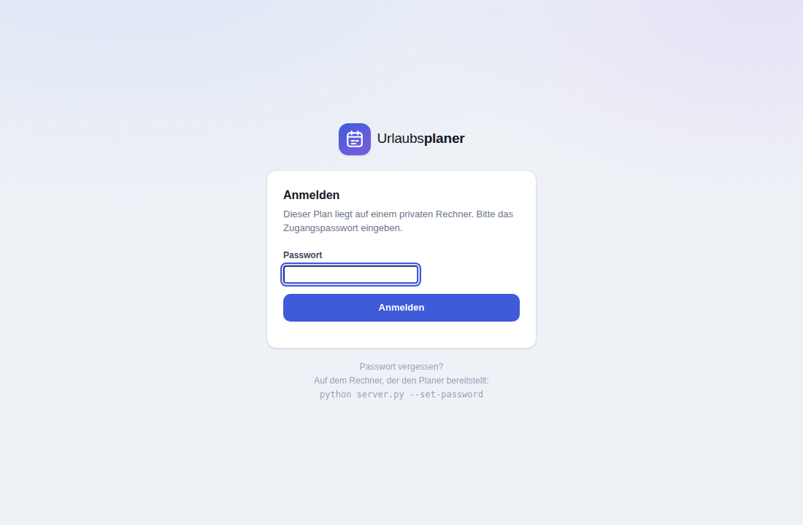

# Von überall zugreifen

Der Urlaubsplaner läuft von Haus aus komplett im Browser. Wer den Plan von
mehreren Geräten aus bearbeiten will – Büro-PC, Handy unterwegs, Laptop zu
Hause – startet stattdessen `server.py`. Dann liegt der Plan in einer Datenbank
auf dem eigenen Rechner, und alle Geräte arbeiten auf demselben Stand.



## In drei Schritten

### 1. Server starten

```bash
cd urlaubsplaner
python server.py
```

Beim ersten Start wird ein Zugangspasswort erzeugt und im Fenster angezeigt:

```
  ╭─────────────────────────────────────────╮
  │  Zugangspasswort für den Urlaubsplaner  │
  │                                         │
  │      ZNqazdA9xj-M                       │
  │                                         │
  │  Notiere es. Ändern lässt es sich mit:  │
  │      python server.py --set-password    │
  ╰─────────────────────────────────────────╯
```

**Notiere dieses Passwort.** Jedes Gerät braucht es einmal zum Anmelden.
Ändern geht jederzeit mit `python server.py --set-password`.

Der Planer ist jetzt erreichbar unter:

| | |
|---|---|
| auf demselben Rechner | `http://localhost:8000` |
| im selben WLAN | `http://192.168.x.x:8000` – die genaue Adresse steht im Fenster |

### 2. Öffentlichen Link erzeugen

Damit der Link auch von unterwegs funktioniert, muss dein Rechner aus dem
Internet erreichbar sein. Am einfachsten geht das mit **Cloudflare Tunnel** –
ohne Eingriff im Router und ohne offenen Port.

Einmalig installieren:

| System | Befehl |
|---|---|
| Windows | `winget install --id Cloudflare.cloudflared` |
| macOS | `brew install cloudflared` |
| Linux | [Paket von Cloudflare](https://developers.cloudflare.com/cloudflare-one/connections/connect-networks/downloads/) |

Danach den Server mit Tunnel starten:

```bash
python server.py --tunnel
```

Im Fenster erscheint eine öffentliche HTTPS-Adresse:

```
  ╭────────────────────────────────────────────────────────╮
  │  Von überall erreichbar unter:                         │
  │                                                        │
  │      https://zufaelliger-name.trycloudflare.com        │
  │                                                        │
  │  Die Adresse gilt, solange dieses Fenster offen bleibt.│
  ╰────────────────────────────────────────────────────────╯
```

Diesen Link auf dem Handy öffnen, Passwort eingeben – fertig.

### 3. Fertig

Ab jetzt gilt: Jede Änderung wird sofort auf dem Rechner gespeichert. Andere
geöffnete Geräte übernehmen sie innerhalb weniger Sekunden, ohne dass jemand
neu laden muss. Oben rechts zeigt ein Punkt den Stand an:

| Anzeige | Bedeutung |
|---|---|
| 🟢 **Gespeichert** | Alles liegt auf dem Server |
| 🔵 **Speichert…** | Die letzte Änderung geht gerade raus |
| 🟡 **Offline** | Server nicht erreichbar. Es wird im Browser weitergearbeitet und alles nachgetragen, sobald die Verbindung wieder steht |

## Feste Adresse

Die Adresse aus `--tunnel` ist bei jedem Start eine andere. Wer eine feste
Adresse möchte – etwa `urlaub.meinefirma.de` – legt bei Cloudflare einen
benannten Tunnel an. Das setzt ein kostenloses Cloudflare-Konto und eine
eigene Domain voraus:

```bash
cloudflared tunnel login
cloudflared tunnel create urlaubsplaner
cloudflared tunnel route dns urlaubsplaner urlaub.meinefirma.de
cloudflared tunnel run --url http://localhost:8000 urlaubsplaner
```

Der Planer selbst wird dann ohne `--tunnel` gestartet:

```bash
python server.py
```

## Beim Hochfahren mitstarten

Damit der Link auch nach einem Neustart wieder da ist, kann der Server
automatisch starten.

**Windows** – `urlaubsplaner.bat` anlegen:

```bat
@echo off
cd /d "C:\Pfad\zu\urlaubsplaner"
python server.py --tunnel
```

Verknüpfung davon in den Autostart-Ordner legen
(`Win+R` → `shell:startup`).

**macOS / Linux** – Eintrag für `crontab -e`:

```
@reboot cd /pfad/zu/urlaubsplaner && python3 server.py --tunnel >> server.log 2>&1
```

Unter Linux mit systemd ist ein Dienst sauberer:

```ini
# /etc/systemd/system/urlaubsplaner.service
[Unit]
Description=Urlaubsplaner
After=network.target

[Service]
User=DEIN_BENUTZER
WorkingDirectory=/pfad/zu/urlaubsplaner
ExecStart=/usr/bin/python3 server.py --tunnel
Restart=always

[Install]
WantedBy=multi-user.target
```

```bash
sudo systemctl enable --now urlaubsplaner
```

## Wo liegen die Daten?

Alles bleibt auf deinem Rechner, im Ordner `urlaubsplaner/data/`:

| Datei | Inhalt |
|---|---|
| `plan.db` | die SQLite-Datenbank mit dem Plan und allen früheren Fassungen |
| `backups/plan-JJJJ-MM-TT.json` | einmal täglich eine lesbare Kopie, die letzten 60 Tage |
| `config.json` | Passwort-Prüfsumme und Sitzungsschlüssel |

Diese Dateien werden **nicht** über den Webserver ausgeliefert – auch nicht an
angemeldete Nutzer. Für ein Backup den Ordner `data/` mitsichern, oder im
Planer über Menü → „Sicherung speichern“ eine JSON-Datei ziehen.

### Frühere Fassungen

Jede Änderung landet als eigene Fassung in der Datenbank; die letzten 300
bleiben erhalten. Im Planer zeigt der Klick auf die Statusanzeige oben rechts
die Liste mit Zeitpunkt und Gerät. Ein Klick auf „Wiederherstellen“ setzt den
Plan zurück – und legt dabei selbst wieder eine Fassung an, sodass sich auch
das rückgängig machen lässt.

## Was passiert bei gleichzeitigen Änderungen?

Der Planer führt zusammen. Grundlage ist der Stand, auf den sich Gerät und
Server zuletzt geeinigt hatten:

- Trägst du am PC Urlaub für Anna ein und gleichzeitig am Handy für Bernd,
  sind hinterher **beide** Einträge da.
- Ändern beide Geräte **denselben** Eintrag, gewinnt das Gerät, an dem du
  gerade arbeitest. Das andere bekommt eine kurze Meldung.
- Löschungen gelten: Was du löschst, bleibt gelöscht.

Nach einer Zusammenführung erscheint der Hinweis „Änderungen von einem anderen
Gerät zusammengeführt“.

## Ohne Verbindung

Bricht die Verbindung ab – Funkloch, Rechner heruntergefahren – arbeitest du
ganz normal weiter. Die Änderungen liegen im Browser und gehen automatisch
raus, sobald der Server wieder erreichbar ist. Die Statusanzeige steht so
lange auf „Offline“.

## Sicherheit

Der Planer ist über den Tunnel öffentlich erreichbar, deshalb:

- **Passwortschutz ist Pflicht.** Ohne Anmeldung liefert der Server weder die
  Seite noch die Daten aus.
- Nach 8 Fehlversuchen ist die Anmeldung für 10 Minuten gesperrt.
- Geprüft wird gegen eine PBKDF2-Prüfsumme; Cloudflare Tunnel verschlüsselt die
  Verbindung durchgehend.
- Ein Passwortwechsel meldet alle Geräte ab.
- Ausgeliefert werden ausschließlich `index.html`, `css/`, `js/` und `docs/`.

> **Zum automatisch erzeugten Startpasswort:** Es liegt zusätzlich im Klartext
> in `data/config.json` (nur für den eigenen Benutzer lesbar), damit
> `--show-password` es wieder anzeigen kann. Wer das nicht möchte, setzt einmal
> ein eigenes Passwort – `python server.py --set-password` löscht die
> Klartextkopie und hinterlegt nur noch die Prüfsumme.

Der Schalter `--no-auth` schaltet die Anmeldung ab. Das ist **nur** für ein
abgeschottetes Heimnetz gedacht; zusammen mit `--tunnel` verweigert der Server
den Start.

## Was du wissen solltest

- **Der Rechner muss laufen.** Schläft er oder ist er aus, ist der Link tot.
  Wer den Plan rund um die Uhr braucht, lässt den Rechner an, deaktiviert den
  Ruhezustand oder nutzt ein kleines Dauergerät wie einen Raspberry Pi.
- **Der Schnelltunnel wechselt die Adresse** bei jedem Neustart. Für einen
  Link, den man sich merken kann, siehe „Feste Adresse“.
- **Ein Passwort für alle.** Es gibt keine getrennten Benutzerkonten – wer das
  Passwort hat, sieht und ändert den ganzen Plan.

## Befehle im Überblick

```bash
python server.py                     # Start auf Port 8000
python server.py --port 8080         # anderer Port
python server.py --tunnel            # zusätzlich öffentlicher HTTPS-Link
python server.py --host 127.0.0.1    # nur dieser Rechner, nicht im Netz
python server.py --set-password      # Passwort ändern (meldet alle Geräte ab)
python server.py --show-password     # erzeugtes Startpasswort anzeigen
python server.py --no-auth           # ohne Anmeldung, nur im eigenen Netz
```

Beenden mit `Strg+C`. Der Plan bleibt gespeichert.
